# ms-template
基于 springboot + vue + element-ui 的管理后台模板，前后端分离，已集成权限控制。

## 技术栈
后端

| 技术                | 版本            | 说明              |  
| ------------------- | -------------- | ----------------- |  
| springboot          | 2.7.14         | 简化spring开发     |  
| spring security     | 5.7.10         | 认证授权框架        |  
| jjwt                | 0.9.1          | jwt登录验证         |  
| mybatis plus        | 3.5.3.1        | orm框架            |
| pagehelper          | 1.4.7          | 分页组件            |  
| lombok              | 1.18.24        | 实体类方法生成工具    |  
| mapstruct           | 1.5.3.Final    | 对象复制、转换工具    |
| knife4j-openapi2    | 4.3.0          | 接口文档            |  
| redis               |                | 分布式缓存          |  
| mysql               |                | 数据库             |

前端

| 技术          | 版本      | 说明          |  
| --------------| --------- | -----------  |  
| [vue-admin-template](https://github.com/PanJiaChen/vue-admin-template)  |     | 项目模板        |  
| vue           | 2.6.10    | MVVM框架     |  
| vue-router    | 3.0.6     | 路由组件      |  
| vuex          | 3.1.0     | 数据管理      |  
| axios         | 0.18.1    | 请求组件      |  
| element-ui    | 2.13.2    | UI框架       |  
| qs            | 6.11.2    | 序列化支持    |  
| screenfull    | 4.2.0     | 全屏支持      |

## 方案设计
[管理后台权限控制.xmind](document/技术方案/管理后台权限控制.xmind)

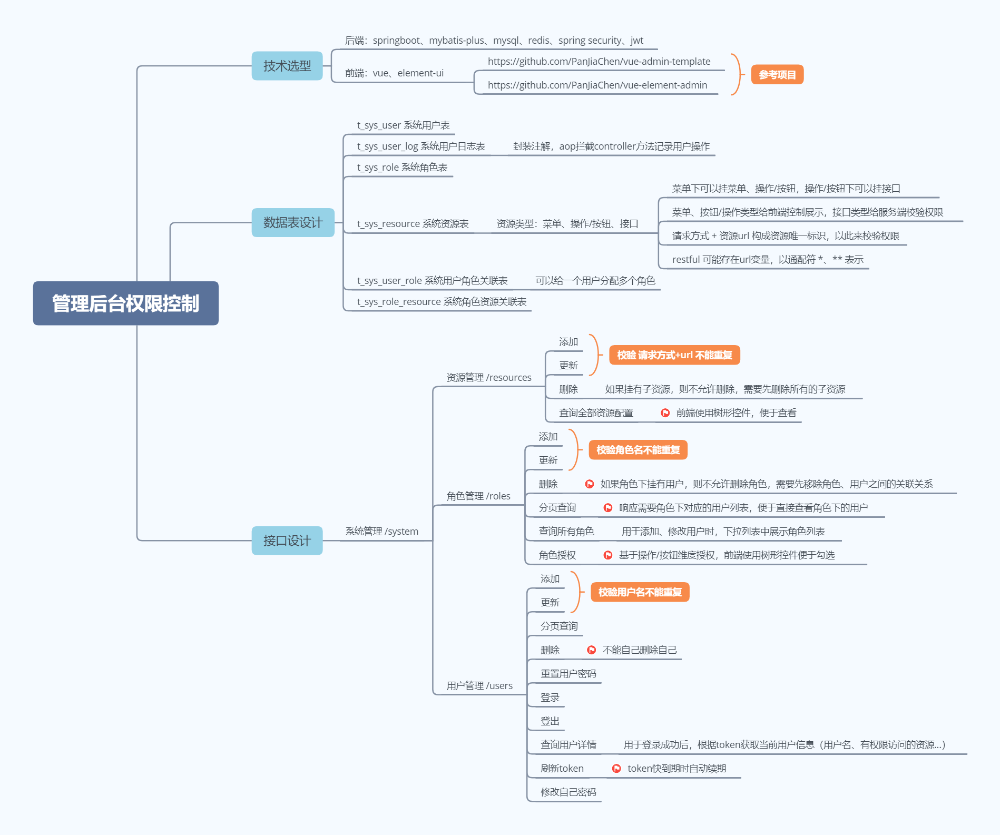

## 使用方式
- [后端 xxx-ms](xxx-ms/README.md)
- [前端 xxx-ms-web](xxx-ms-web/README.md)

## 功能说明
1、缓存封装：可通过注解方式使用缓存，支持自定义缓存，实现缓存接口 CacheService，在 CacheAspect 中注入对应缓存即可。

2、操作日志封装：可通过注解方式记录用户操作。
   
3、为保证spring security校验用户接口权限的效率，直接缓存了用户权限信息，查1次缓存就能拿到用户具有权限的所有资源， 但为此牺牲了用户权限更新的实时性
- 资源管理：新增、编辑、删除资源后，需要重新登录或等用户资源缓存过期才会拉取展示最新的、拥有访问权限的资源。
- 角色管理：角色授权后，需要对应用户重新登录或等用户资源缓存过期才会刷新具有的权限。
- 用户管理：新增、编辑、删除实时生效。

4、未对系统用户行为做太多限制，只要有对应权限，就认为相关操作合法。比如给普通用户分配了删除系统用户权限，则普通用户可以删除其它系统用户（包括更高等级的管理员），需要分配者自行把握权限分配。

## 界面截图
登录页面

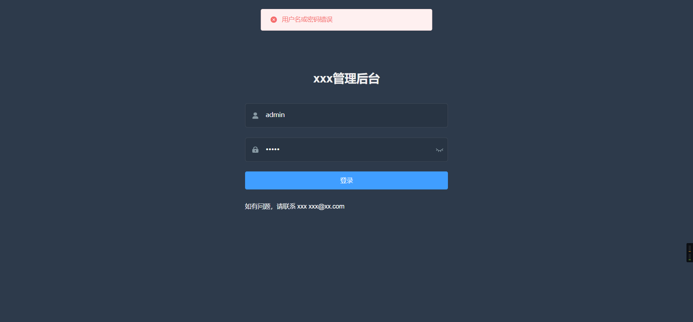

主页及侧边栏

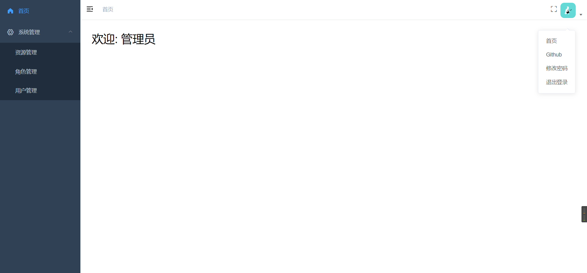

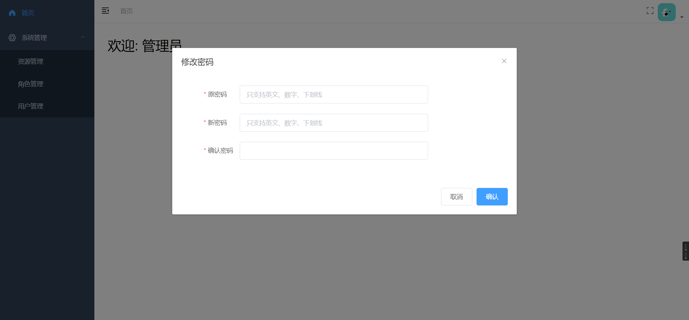

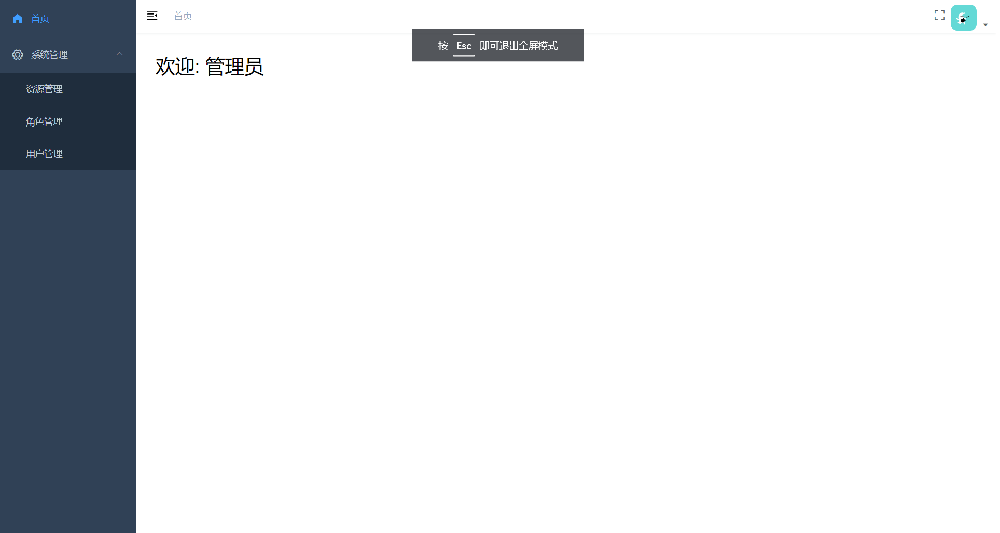

资源管理

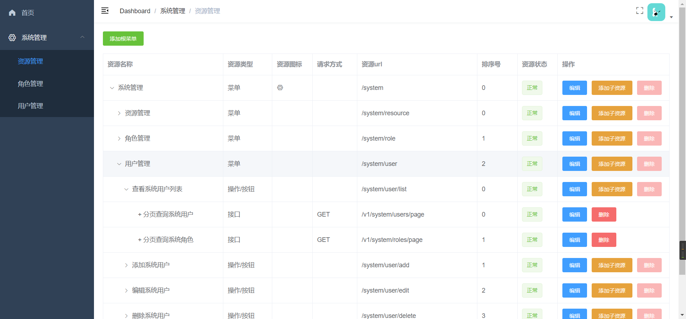

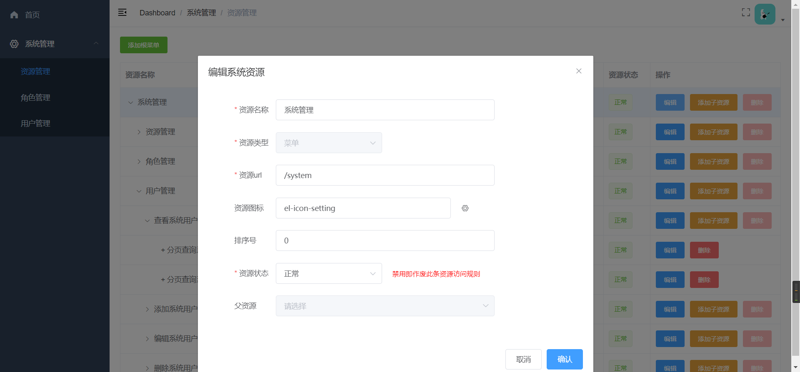

角色管理

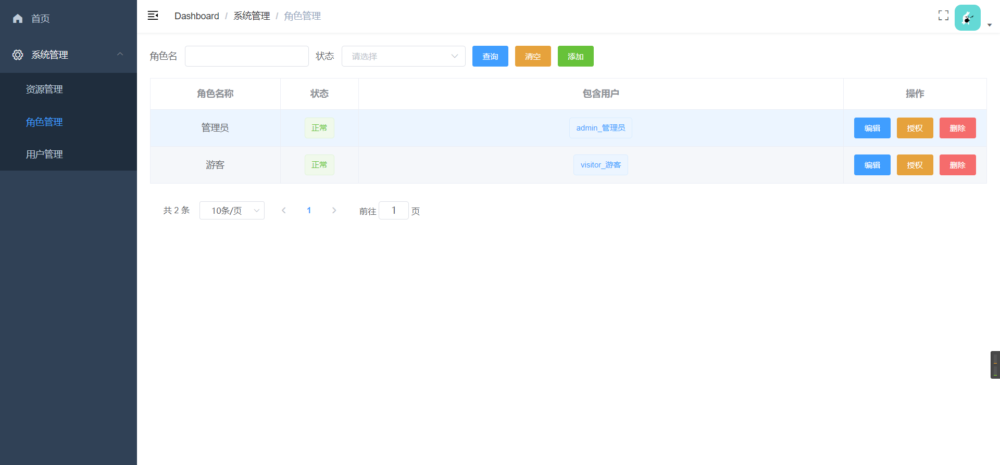

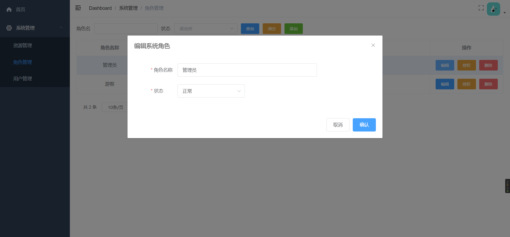

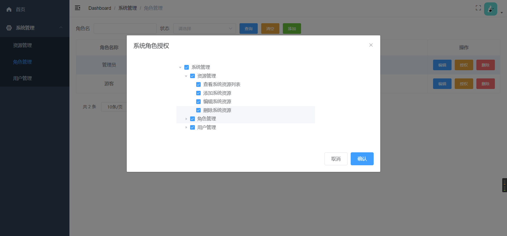

用户管理

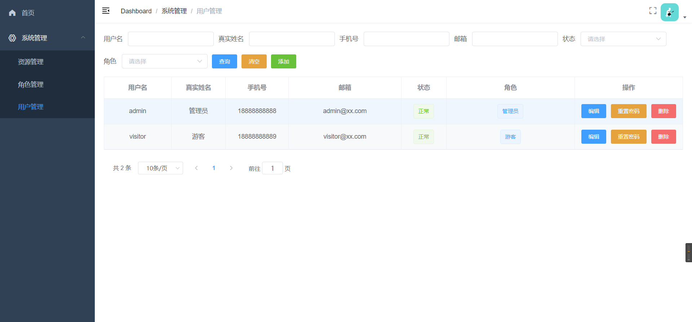

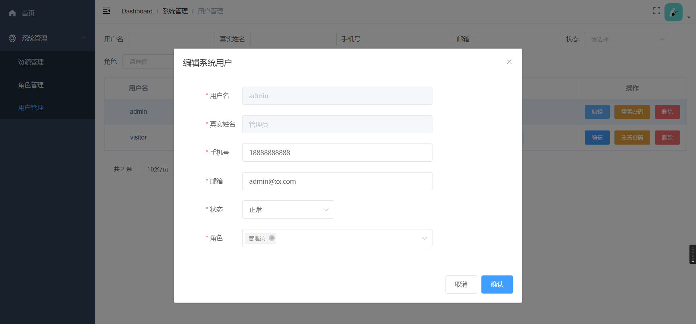

接口文档

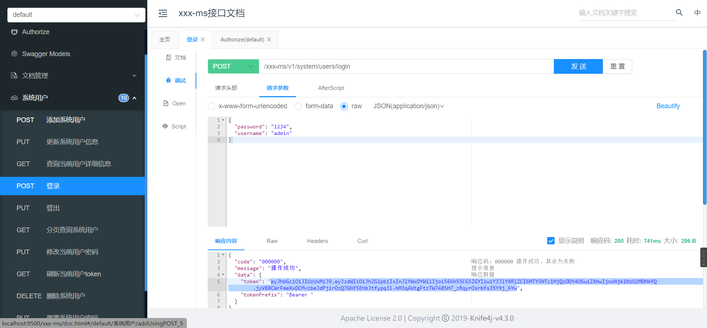

## 参考项目
- [https://github.com/macrozheng/mall-tiny](https://github.com/macrozheng/mall-tiny)
- [https://github.com/PanJiaChen/vue-admin-template](https://github.com/PanJiaChen/vue-admin-template)
- [https://github.com/PanJiaChen/vue-element-admin](https://github.com/PanJiaChen/vue-element-admin)
